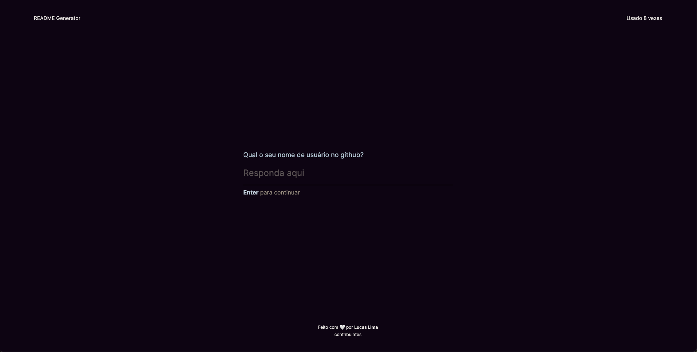

    

 

# ReadMe Generator

> ReadMe Generator | Crie o seu README.md de forma fácil e rápida

## 💻 Projeto

O ReadGenerator é uma aplicação para criar README.md de forma rápida. Com essa plataforma open source é possível criar os readme da sua aplicação de forma gratuita.

## 🔖 Layout

Você pode visualizar o layout do projeto através [desse link](https://readgenerator.vercel.app/). É necessário ter conta no [Figma](https://figma.com) para acessá-lo.

---

### 📄 O que foi usado:

- Nextjs
- TypeScript
- Tailwind
- Axios
- MongoDB
- Nodejs
- Express

### 🛠 Mão na massa:

> Você pode realizar o clone deste repositório!

Clone o repositório:

`
git clone https://github.com/Lucaslimasz/readgenerator-server
`
 
### 💻 Executando o projeto 🚀

#### Na raiz do projeto, execute os comandos:

# Para instalar as dependências
yarn

# Para startar o projeto utilize
yarn start || npm install e 
